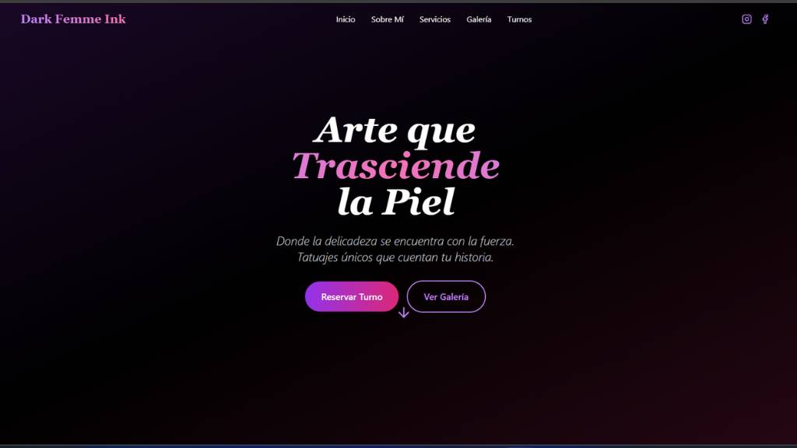
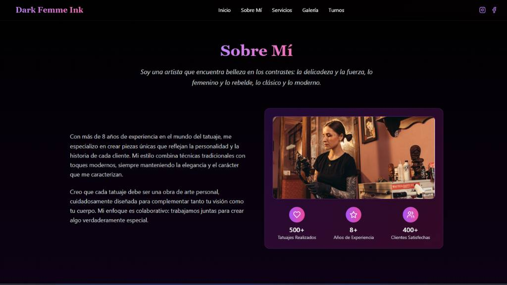
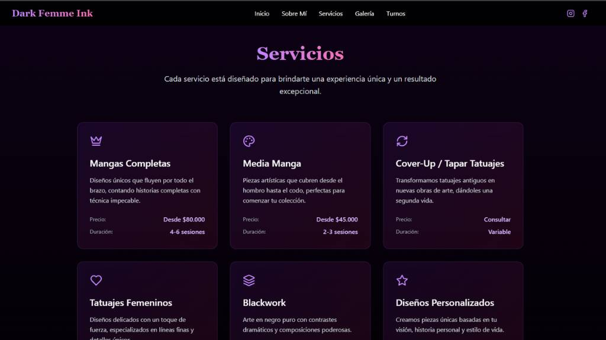
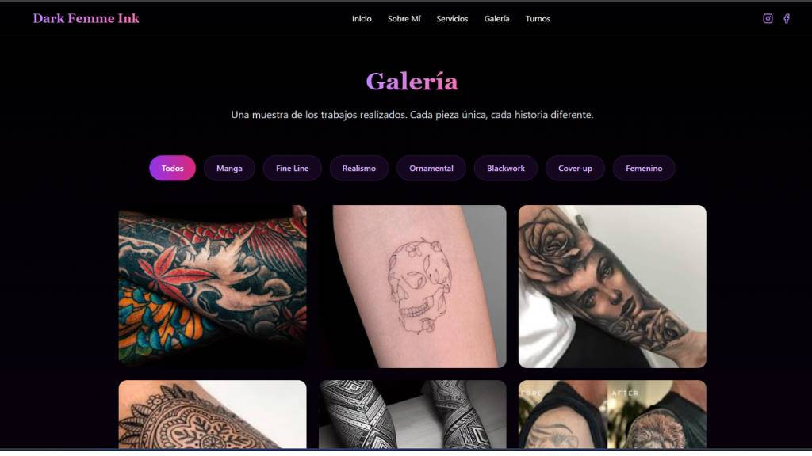
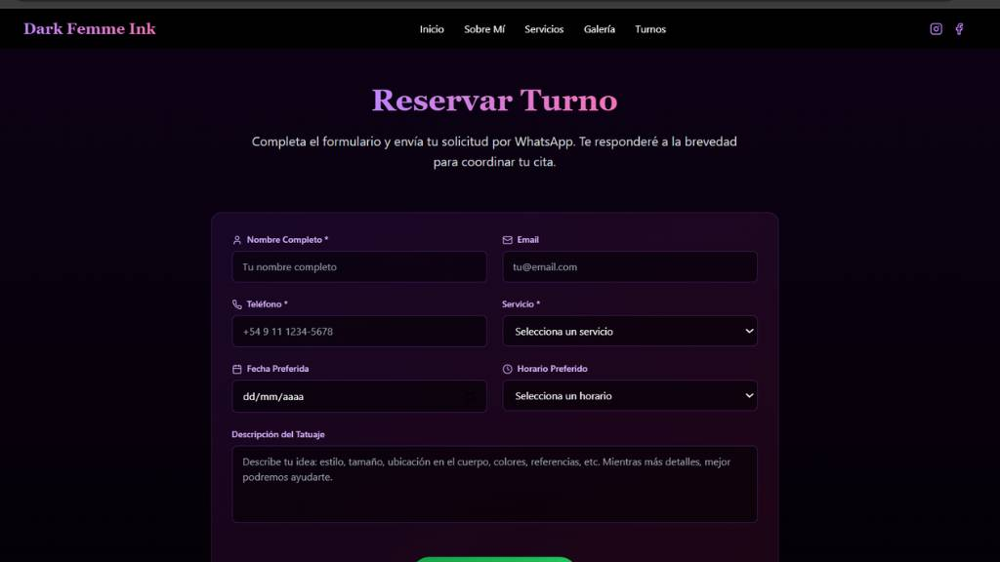
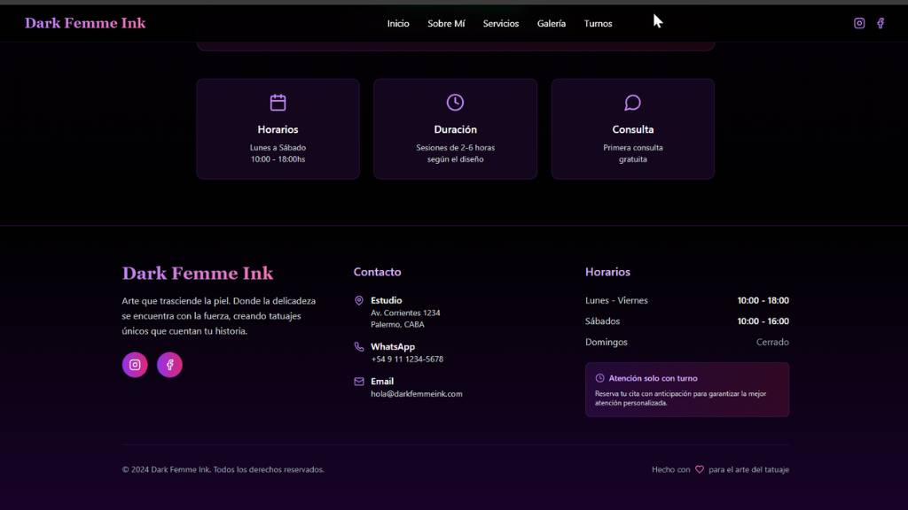

# 🖋️ TatooFem

Sitio web desarrollado para un estudio de tatuajes femeninos.

Visitar sitio en vercel [https://tatoofem.vercel.app/]

### 📌 Descripción
Proyecto real de diseño y desarrollo de una página web para un estudio especializado en tatuajes. El objetivo fue crear una experiencia visual atractiva, clara y funcional, destacando trabajos realizados, información del estudio y formas de contacto.

---

## 🖼️ Capturas del sitio

### 🧨 Hero

---

### 🙋 About

---

### 🛎️ Services

---

### 🖼️ Gallery

### 📬 Contact Form

---

### 🦶 Footer

---

### 🔧 Tecnologías usadas

- React
- Tailwind
- Git - Github
- Vercel
---

### 🎯 Funcionalidades

- Página de inicio con presentación del estudio
- Galería de tatuajes y diseños realizados
- Formulario de contacto
- Información de ubicación y horarios

---

### 🧠 Lo que aprendí

- Cómo adaptar diseño visual a una estética concreta (en este caso, femenina y artística)
- Organización de contenido según objetivos reales del cliente
- Optimización para visibilidad básica y carga rápida

---

### Codigo abierto

> Podes Acceder al repo
> ## 📁 Clonar el repositorio

git clone https://github.com/ignacio-leonel/tatoofem.git
cd tatoofem
npm install
npm run dev

---

### 📫 Contacto

- LinkedIn: [Ignacio Leonel Maldonado](https://www.linkedin.com/in/ignacio-leonel/)
- Portfolio: [nachoweb.com.ar](https://nachoweb.com.ar/)
